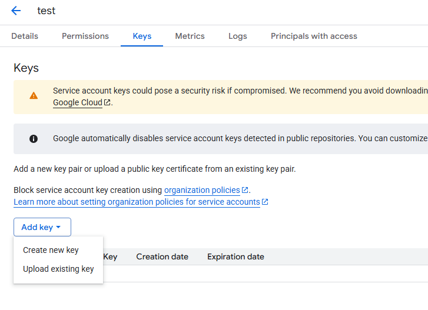
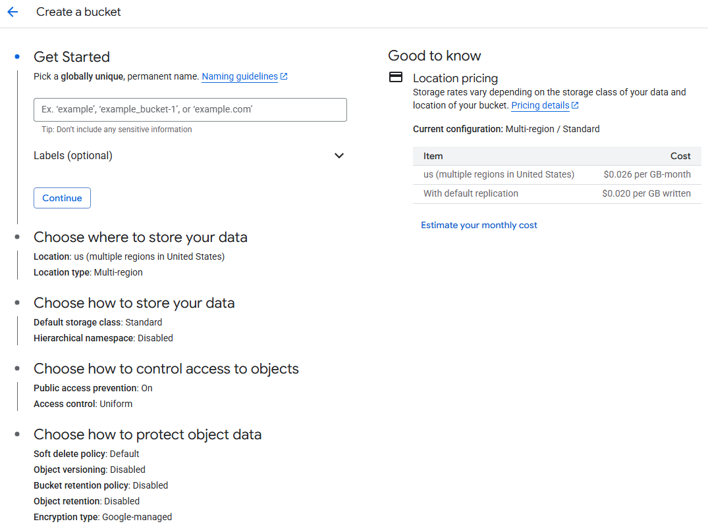
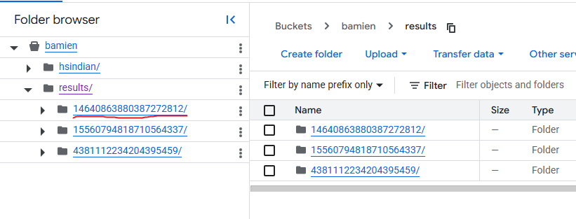

# dabamien_google_ocr
Using Google Document AI to scan pdf

Google colab 檔案 https://colab.research.google.com/drive/1Y__UqZBHwWkJNk34gluTabg8HSZc28xy

請完成前置步驟再開始執行此Colab

## 前置步驟

### 步驟1 點開Google Document AI 文件
https://codelabs.developers.google.com/codelabs/docai-ocr-python 

參考此文件第2-4步驟 建立基本環境及專案 

### 步驟2. Setup and Requirements
記住建立的PROJECT_ID   

### 步驟3. Enable the Document AI API

打開Google Cloud Console
搜尋欄輸入 Document AI API, Google Cloud Storage API

確保API已啟用

### 步驟4
記住建立的PROCESSOR_ID (一串隨機生成英數字)

### 步驟五 設置身分驗證

1. 建立服務帳戶：

    進入 Google Cloud Console。
    導航到 IAM 與管理 (IAM & Admin) > 服務帳戶 (Service Accounts)。
    建立一個新的服務帳戶(點選"+Create service account")
    
    隨機輸入Service account name, 點選Create and Continue
    

    並為其分配必要的角色（例如 Document AI API User, Document AI Administrator, Service Usage Consumer, Storage Admin） 點選Done。

    
    
2. 下載服務帳戶密鑰：
    建立服務帳戶後，在列表選擇剛剛建立的服務帳戶
    點選Keys >> Add key >> Create new key >> JSON >> Create
    
    
    自動下載 JSON 格式的密鑰檔案，請保存好檔案。

### 步驟六 建立Google Cloud Storage bucket
參考文件 https://cloud.google.com/storage/docs/discover-object-storage-console

1. 建立bucket
    進入 Google Cloud Console >> Cloud Storage >> Create bucket
    建立名稱 BUCKET_NAME, 請記住這個名字，點選Continue
    
    Location type: Multi-region "us"
    接著直接點選Create即可
2. 建立分析資料夾
    點選左側欄位Buckets, 可在這建立資料夾階層管理資料
    (舉例 建立hsindian資料夾並上傳測試文件)
    

    此路徑為 <b>"gs://bamien/hsindian"</b>

3. 建立結果資料夾
    建立results資料夾
    此路徑為 <b>"gs://bamien/results"</b>

## 開始分析

1. 打開Google colab 檔案 https://colab.research.google.com/drive/1Y__UqZBHwWkJNk34gluTabg8HSZc28xy

2. 安裝前三個套件, 安裝後會需要重啟kernal, 就不用再執行一次
    

3. 上傳 步驟五 的金鑰至左側檔案區, 並將檔案名稱替換

4. Batch Processing Request to Document AI 執行後結果
    
    對應至Cloud Storage 裡results會產生新的資料夾
    

5. 下載Batch Processing的結果

    output_prefix = 更換成Google Storage上想要分析的資料夾名稱  # Batch Processing的輸出目錄 #從Google Storage上選擇

6. 依序執行儲存格, 分析結果會出現在左側欄位資料夾parsed_results
    